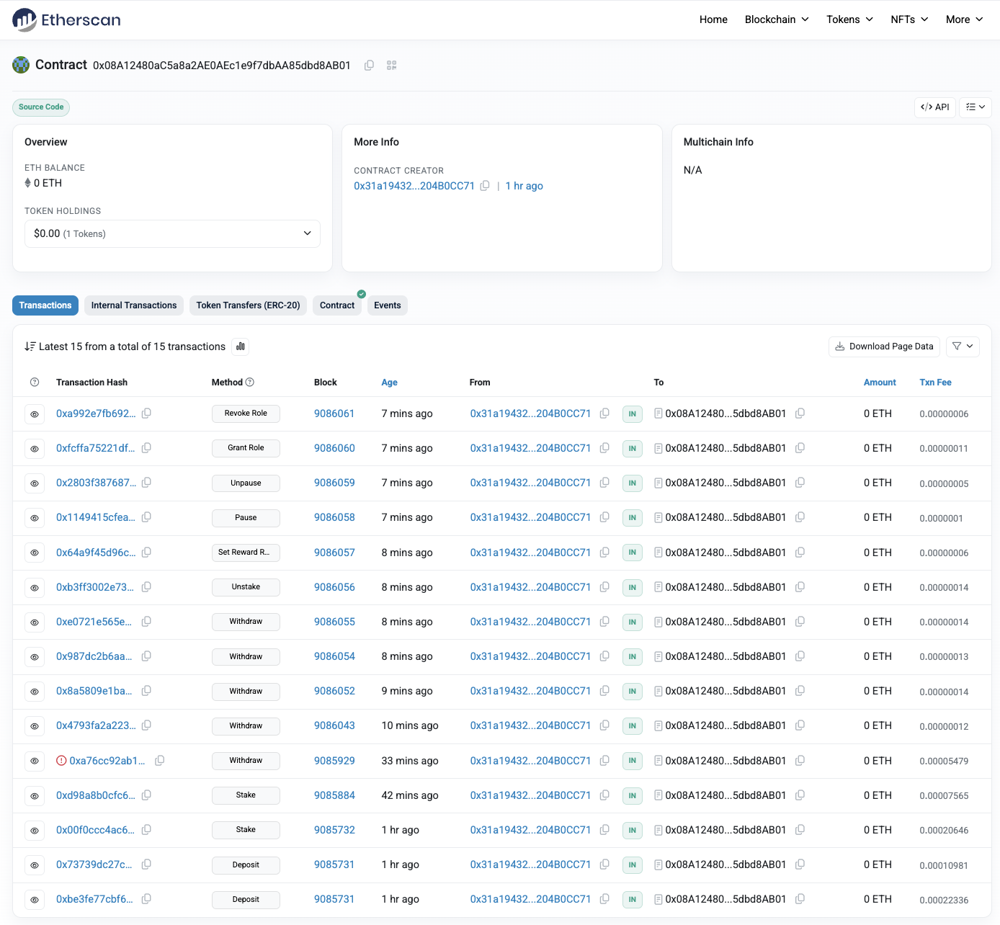

# Institutional Staking

An on-chain custody + staking system demonstrating dual reward models, precise emission accounting, admin controls, and a full Etherscan showcase of every externally callable action.


https://sepolia.etherscan.io/address/0x08a12480ac5a8a2ae0aec1e9f7dbaa85dbd8ab01


## What it does

- Securely custodies an ERC20 token and tracks user principal (deposited vs staked)
- Two deposit overloads: `deposit(uint256)` for the staking token, and `deposit(address,uint256)` for generic custody of any ERC20 (no rewards)
- Dual reward mechanisms:
	- Continuous per-second emission model with remainder carry (no rounding drift)
	- Alternative annual-rate withdrawal path applying fixed 5% APR (prorated by staking duration) via the `withdraw(uint256)` overload
- Flexible withdrawals: claim emission-only rewards, principal-only, both, or APR-style principal+rewards
- Precise accounting: carries sub-wei emission fractions forward (`rewardRemainder`)
- Role-based admin (separate `ADMIN_ROLE`) to update reward rate and pause/unpause
- Pausable + ReentrancyGuard hardening
- Rich event surface for analytics (Deposit/Deposited, Stake/Staked, Withdraw/Withdrawn, RewardsAccrued, RewardRateUpdated, Unstaked, Pause/Unpause, AccessControl events)
- Express API + scripts for automated demonstrations (including full Etherscan action showcase)

## Project structure

```
onchain-custody-staking/
├── contracts/              # Solidity sources (InstitutionalStaking, mocks)
├── scripts/                # Hardhat & operational scripts (deploy, showcase, demos)
├── src/                    # Express server + ethers helpers
├── test/                   # Hardhat tests (staking, rewards, edge cases)
├── typechain-types/        # Generated TypeScript typings (not committed)
├── assets/                 # Images / screenshots (add showcase.png, etc.)
├── hardhat.config.ts       # Hardhat configuration
├── package.json            # NPM scripts & dependencies
├── tsconfig.json           # TypeScript config
└── README.md               # You are here
```

## Building & Testing

```bash
npm install
npm run compile      # hardhat compile (generates typechain, artifacts)

```

Optional lint & format:
```bash
npm run lint
npm run format:check
```

## Core reward models

### Emission (per-second linear)
```
raw = staked * rewardRate * deltaSeconds         // scaled by 1e18
totalScaled = raw + previousRemainder
newRewards  = totalScaled / 1e18
remainder   = totalScaled % 1e18
```
`rewardRate` = tokens per second per token (scaled 1e18). The carried `remainder` eliminates long-term precision loss.

### Annual APR (withdraw overload)
```
annualRewards = withdrawn * ANNUAL_RATE_BPS * duration / (SECONDS_PER_YEAR * 10_000)
```
Applied only when calling `withdraw(uint256)` (APR path). Independent from emission accrual state.

## Deployment (Sepolia example)

Environment (.env):
```
RPC_URL=https://eth-sepolia.g.alchemy.com/v2/<KEY>
PRIVATE_KEY=0x<deployerPrivKey>
TOKEN_ADDRESS=0x<erc20Token>
REWARD_RATE=1000000000000000000   # 1 token/sec/token (scaled 1e18)
ADMIN_ADDRESS=0x<admin>
ETHERSCAN_API_KEY=<etherscan>
```

Deploy & verify:
```bash
npx hardhat run scripts/deploy.ts --network sepolia
# wait a few confirms then run the printed verify command
```

Fund rewards (single-token model):
```bash
npx hardhat console --network sepolia
> const t = await ethers.getContractAt("ERC20Mock", process.env.TOKEN_ADDRESS)
> t.transfer("<stakingAddress>", ethers.parseEther("500000"))
```

## Full Etherscan Action Showcase

Script: `scripts/fullEtherscanShowcase.ts` — emits (optionally with auto reward funding) one tx for every externally callable, state-changing function:

Actions covered:
1. approve (ERC20)
2. deposit(uint256)
3. deposit(address,uint256) (optional; requires ALT_TOKEN_ADDRESS)
4. stake(uint256)
5. withdraw(uint256,bool) principal-only
6. withdraw(0,bool) emission claim
7. withdraw(uint256) APR path
8. unstake(uint256)
9. setRewardRate(uint256)
10. pause()
11. unpause()
12. grantRole(bytes32,address) (optional INCLUDE_ROLES=1)
13. revokeRole(bytes32,address) (optional)
14. (auto-fund) mint() on ERC20Mock (if AUTO_FUND=1)

Run (dry):
```bash
SHOW_ONLY=1 INCLUDE_ROLES=1 STAKING_ADDRESS=<addr> TOKEN_ADDRESS=<token> npx hardhat run --network sepolia scripts/fullEtherscanShowcase.ts
```

Run (live with auto reward top-up):
```bash
INCLUDE_ROLES=1 AUTO_FUND=1 STAKING_ADDRESS=<addr> TOKEN_ADDRESS=<token> npx hardhat run --network sepolia scripts/fullEtherscanShowcase.ts
```

Key env vars:
- DEPOSIT_AMOUNT (ether units)
- STAKE_PERCENT
- IDLE_WITHDRAW_PERCENT
- ANNUAL_WITHDRAW_PERCENT
- WAIT_SECONDS (emission accrual delay)
- ECONOMY=1 (tighter maxFee strategy)
- GAS_BUDGET_ETH (cap total fee exposure)
- INCLUDE_ROLES=1 (role grant/revoke showcase)
- AUTO_FUND=1 (mint reward shortfall via ERC20Mock)
- SHOW_ONLY=1 (no sends)

## Quick incremental demo

For a concise feature run: `scripts/quickDemo.ts` or `scripts/quickDemoCompact.ts`.

Example:
```bash
STAKING_ADDRESS=<addr> TOKEN_ADDRESS=<token> DEPOSIT_AMOUNT=1 STAKE_PERCENT=60 WAIT_SECONDS=30 SHOW_ONLY=1 \
	npx hardhat run --network sepolia scripts/quickDemoCompact.ts
```

## Express API

Environment:
```
RPC_URL=...
PRIVATE_KEY=0x...
STAKING_ADDRESS=0x...
TOKEN_ADDRESS=0x...
PORT=4000
```

Run:
```bash
npm run dev:server
# or
npm run build:server && npm run start:server
```

Endpoints:
- GET /balance/:address
- POST /deposit { address, amount, tokenAddress? }
- POST /stake { address, amount }
- POST /withdraw { address, amount }

## Operational notes

- Contract must hold enough tokens to cover emission + APR + principal.
- Emission remainder prevents cumulative precision loss.
- Overloaded functions require signature disambiguation in TS (e.g. `contract["withdraw(uint256,bool)"]`).
- Reward funding strategy: either pre-fund large reserve or enable AUTO_FUND with a mint-capable mock in showcase environment.

## Recent updates
- Added full action showcase script (role grant/revoke + auto funding)
- AUTO_FUND logic to mint shortfall before reward claim
- Refactored runtime imports to use TypeChain factories (removed artifact dependency in server)
- Gas budgeting support (GAS_BUDGET_ETH) and economy fee tuning

## Lessons learned
### What went well
- Remainder-carry emission model yields exact long-term accounting
- Dual reward mechanisms broaden demo scenarios for auditors
- TypeChain integration improved DX and removed fragile JSON imports

### Challenges
- Ensuring reward funding sufficiency across both models
- Managing showcase ordering without double-counting rewards
- Handling overload signatures ergonomically in scripts & API

### If revisiting
- Consider modularizing reward models behind strategy pattern
- Add off-chain indexer examples (The Graph / Substreams)
- Introduce per-user reward funding safety checks

## Roadmap / TODO
- Renounce role showcase tx (optional)
- Frontend dashboard (balances & live emission rate visualization)
- CLI tool for batched maintenance operations
- Additional reward strategy examples (e.g., variable rate schedule)
- Gas usage report exporter

